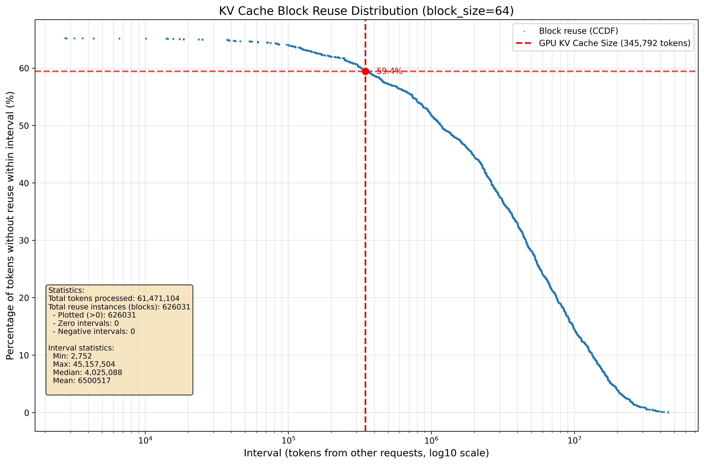
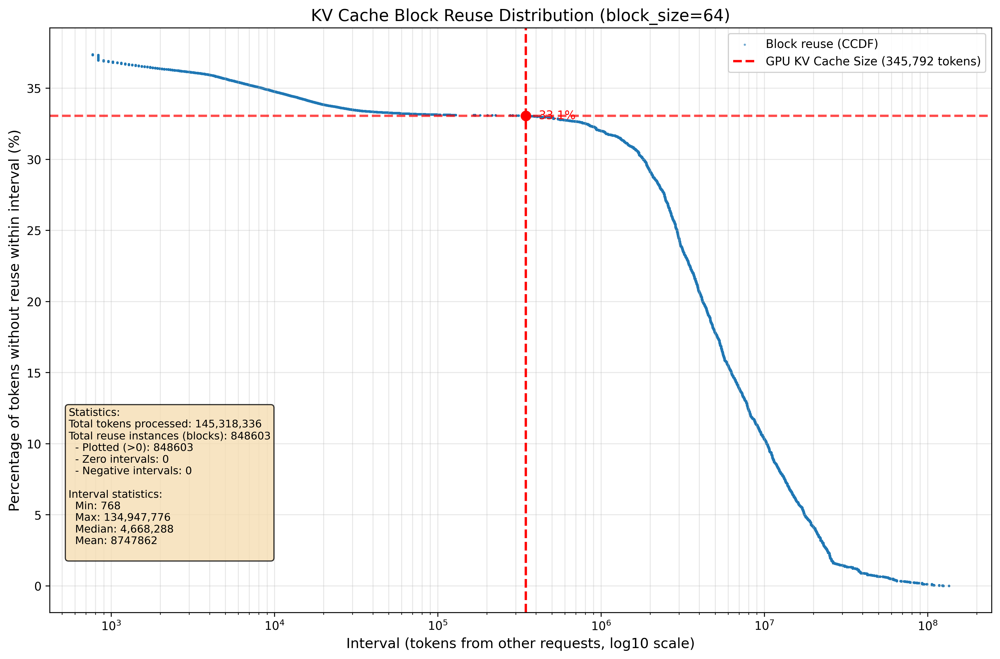

# KV Cache Hit Rate Analysis Tool

A Python tool for analyzing KV cache hit rate in LLM inference workloads, inspired by [peaceforeverCN](https://github.com/peaceforeverCN)
## Overview

Based on our previous experiments, identical blocks need to be temporally distant to be evicted from GPU memory and cached by lower tier storages — for KV cache offloading to be effective.

Here, we use the number of interval tokens as a measure of time duration. We analyze the percentage of KV cache that is not reused by the GPU under different token intervals. When the GPU KV cache size is determined, this percentage represents the upper bound of KV cache that can be offloaded.


## Prerequisite

```bash
pip install transformers torch matplotlib numpy tqdm
```

## Usage

### Basic Usage

```bash
python analyze_block_reuse.py \
  --input-file /path/to/inputs.json \
  --model-name deepseek-ai/DeepSeek-V3.1 \
  --block-size 64 
```

### With GPU KV Cache Size Reference

```bash
python analyze_block_reuse.py \
  --input-file /path/to/inputs.json \
  --model-name deepseek-ai/DeepSeek-V3.1 \
  --block-size 64 \
  --gpu-kv-cache-size 345792 \
  --output my_analysis.png
```

### Command Line Arguments

| Argument | Type | Default | Description |
|----------|------|---------|-------------|
| `--block-size` | int | 64 | Size for KV cache blocks |
| `--input-file` | str | `/workspace/inputs_conversation.json` | Path to input JSON file containing requests |
| `--model-name` | str | `deepseek-ai/DeepSeek-V3.1` | HuggingFace model name or local path for tokenizer |
| `--gpu-kv-cache-size` | int | None | GPU KV cache size in tokens, which can be observed during vLLM startup: GPU KV cache size: xxx tokens  (draws reference lines if set) |
| `--output` | str | `block_reuse_distribution.png` | Output file path for the generated plot |

## Input Format

Based on the [Mooncake traces](https://github.com/kvcache-ai/Mooncake/tree/main/FAST25-release/traces), I used [aiperf](https://github.com/ai-dynamo/aiperf/tree/main) to convert them into actual requests with the following format:

```json
{
  "data": [
    {
      "session_id": "session-id-1",
      "payloads": [
        {
          "messages": [
            {
              "role": "user",
              "content": "Your message content here..."
            }
          ]
        }
      ]
    }
  ]
}
```

## Output Visualization

The tool generates a scatter plot showing the **Complementary Cumulative Distribution Function (CCDF)** of block reuse intervals.

### Understanding the Plot

- **X-axis**: Token interval between block reuses (log10 scale)
- **Y-axis**: Percentage of tokens that are NOT reused within the given interval
- **Red lines** (if GPU cache size is specified): 
  - Vertical line indicates the GPU KV cache capacity
  - Horizontal line shows what percentage of tokens can be cached in lower tier storage (e.g. CPU, SSD)

### Example Results

#### [synthetic_trace](https://github.com/kvcache-ai/Mooncake/blob/main/FAST25-release/traces/synthetic_trace.jsonl)




#### [conversation_trace](https://github.com/kvcache-ai/Mooncake/blob/main/FAST25-release/traces/conversation_trace.jsonl)




## How It Works

### 1. Interval tokens

For each block that appears multiple times:
- Calculate the number of tokens from **OTHER requests** between consecutive appearances
- Only count cross-request reuse (same-request reuse is filtered out)


